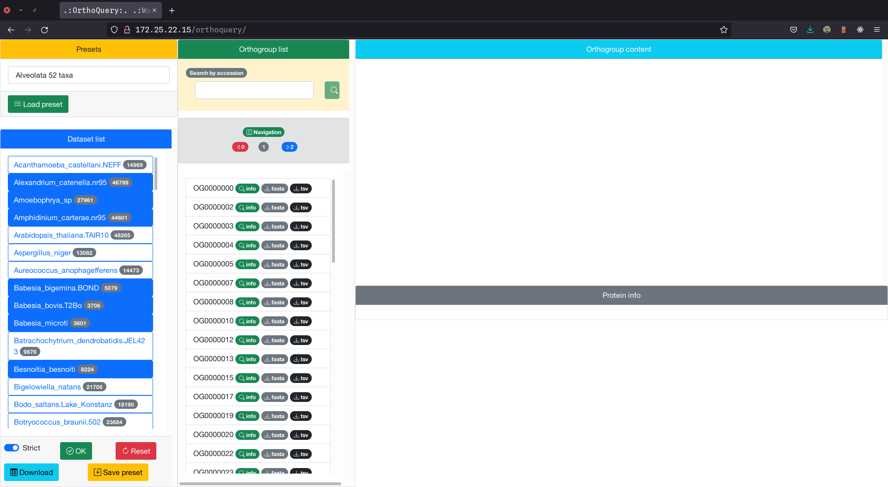
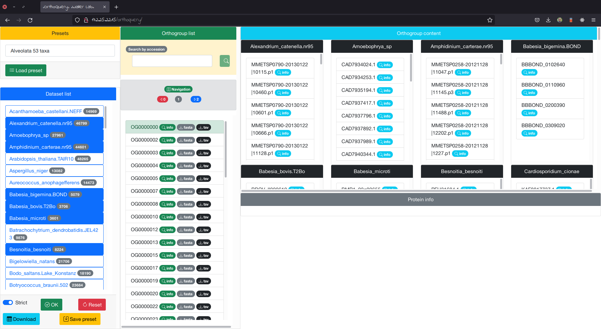
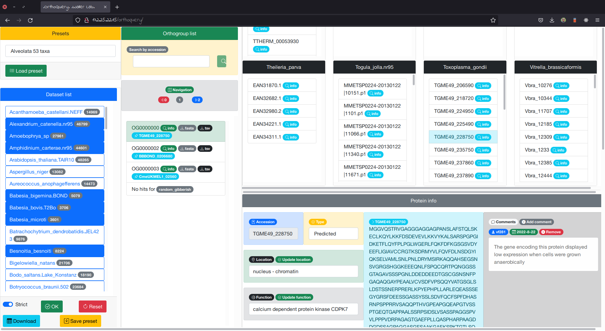
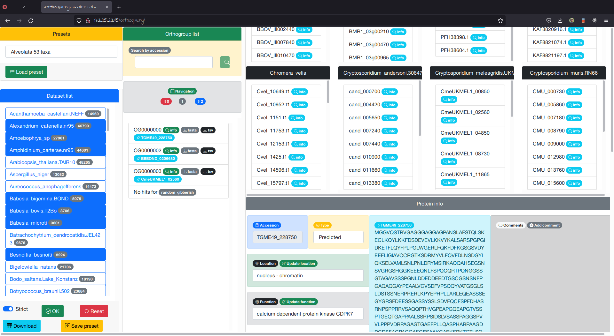

# OrthoQuery
## A platform for the exploration and annotation of orthogroups
One of the most common reasons for running OrthoFinder (or other Orthology software) is to find the orthologue of a gene you’re interested in. However, when big datasets are compared, it becomes difficult to explore the results mostly because of the size and structure of the expected output.

A simple example of the output produced by OrthoFinder is shown below

|Orthogroup|Species 1|Species 2|Species 3|Species 4|
|:--------:|:-------:|:-------:|:-------:|:-------:|
|OG00000001|ACC_001,ACC_002,ACC_003|BCC_001|CCC_001,CCC_002,CCC_003,CCC_004|""|

The orthogroup OG00000001 has three representatives in Species 1, one representative in Species 2, four representatives in Species 3 and no representatives in Species 4.

Although the overall structure is simple, things get complicated when the analysis includes large sets of species, hundreds of thousands of orthogroups and hundreds of proteins per species per orthogroup.

In addition, although orthology analyses by themselves are quite useful, parsing the results of such analyses and incorporating additional information such as manual annotations can be time consuming and prone to errors in the absence of a standardised platform for the incorporation of manual information.

Here's when OrthoQuery comes in handy.

OrthoQuery is a platform built as a web application that takes the output of OrthoFinder and allows the user to explore, filter, export and annotate different orthogroups, taxa, proteins and annotations.

The following document serves as the user manual for OrthoQuery.

# Access and general usage:

The application is hosted in the wallerlab server and can be accessed by opening the following address: http://172.25.22.15/orthoquery

The application starts by asking the user their identity, this is required so that the annotations and comments can be properly referred.

Right after the user provides their credentials, the datasets with which the Orthology analysis was run are loaded in the blue panel at the left-hand side of the page. The results currently hosted in the server were obtained by comparing the proteins of 99 datasets corresponding to 97 species.

|Species|Species|Species|Species|Species|Species|Species|Species|Species|
|-------|-------|-------|-------|-------|-------|-------|-------|------|
|Acanthamoeba_castellani.NEFF|Alexandrium_catenella.nr95|Amoebophrya_sp|Amphidinium_carterae.nr95|Arabidopsis_thaliana.TAIR10|Aspergillus_niger|Aureococcus_anophagefferens|Babesia_bigemina.BOND|Babesia_bovis.T2Bo|
|Babesia_microti|Batrachochytrium_dendrobatidis.JEL423|Besnoitia_besnoiti|Bigelowiella_natans|Bodo_saltans.Lake_Konstanz|Botryococcus_braunii.502|Caenorhabditis_elegans.WS283|Cardiosporidium_cionae|Chlamydomonas_reinhardtii.external|
|Chlamydomonas_reinhardtii.GeneCatalog|Chromera_velia|Chrysochromulina_tobinii.CCMP291|Crassostrea_virginica|Crypthecodinium_cohnii.Libby_4|Cryptosporidium_andersoni.30847|Cryptosporidium_meleagridis.UKMEL1|Cryptosporidium_muris.RN66|Cryptosporidium_parvum|
|Cyanidioschyzon_merolae.10D|Cyclospora_cayetanensis|Cytauxzoon_felis.Winnie|Danio_rerio|Dictyostelium_discoideum.AX4|Dinophysis_acuminata.nr95|Drosophila_melanogaster|Durinskia_baltica.nr95|Ectocarpus_siliculosus|
|Eimeria_acervulina.Houghton|Eimeria_tenella|Entamoeba_histolytica.HM1IMSS|Galdieria_sulphuraria.074W|Gregarina_niphandrodes|Guillardia_theta.CCMP2712|Hammondia_hammondi.HH34|Hepatocystis|Heterocapsa_triquestra.nr95|
|Homo_sapiens.GRCh38.ref|Ichthyophthirius_multifiliis|Karenia_brevis.nr95|Karlodinium_micrum.nr95|Kluyveromyces_lactis|Kryptoperidinium_foliaceum.nr95|Leishmania_major.Friedlin|Leishmania_mexicana.MHOMGT2001U1103|Lingulodinium_polyedra.nr95|
|Monosiga_brevicollis.MX1|Mucor_circinelloides.1006PhL|Naegleria_fowleri.ATCC30863|Nannochloropsis_gaditana.CCMP526|Nematostella_vectensis|Neospora_caninum|Noctiluca_scintillans.nr95|Oryza_sativa.IRGSP|Oxyrrhis_marina.nr95|
|Oxytricha_trifallax|Paramecium_tetraurelia|Perkinsus_atlanticus|Perkinsus_chesapeaki|Perkinsus_marinus|Phaeodactylum_tricornutum.CCAP_1055_1|Physcomitrella_patens|Phytophthora_infestans.T30-4|Plasmodiophora_brassicae.e3|
|Plasmodium_berghei.ANKA|Plasmodium_falciparum|Plasmodium_vivax.P01|Polarella_glacialis|Protoceratium_reticulatum.nr95|Pseudocohnilembus_persalinus|Rhodotorula_toruloides.ATCC_204091|Saccharomyces_cerevisiae_S288C|Saprolegnia_parasitica|
|Sarcocystis_neurona.SN3|Schizochytrium_aggregatum.nr95|Schizosaccharomyces_pombe|Stentor_coeruleus|Stylonychia_lemnae|Symbiodinium_microadriaticum_2.nr95|Symbiodinium_microadriaticum|Tetrahymena_thermophila|Thalassiosira_pseudonana|
|Theileria_annulata.Ankara|Theileria_equi.WA|Theileria_orientalis.Shintoku|Theileria_parva|Togula_jolla.nr95|Toxoplasma_gondii|Trichomonas_vaginalis.G3|Trypanosoma_brucei.TREU927|Vitrella_brassicaformis|

Users can select a number of datasets based on the organisms that they want to compare, to avoid repetitive clicking, users can save their list of organisms as predefined presets and load them for future use. In the example below the selected preset automatically loads the data corresponding to 52 taxa from the Alveolate group

If the users want to start over, they can click the right button.

There can be orthogroups for which only certain species have representatives, the users can filter out these orthogroup by toggling the "Strict" switch on and off.

For instance

|Orthogroup|Species 1 |Species 2 |Species 3 |Species 4 |
|:--------:|:--------:|:--------:|:--------:|:--------:|
|OG00000001|Acc_num_A1|Acc_num_B1|Acc_num_C1|Acc_num_D1|
|OG00000002|Acc_num_A2|Acc_num_B2|          |Acc_num_D2|
|OG00000003|Acc_num_A3|Acc_num_B3|          |          |

With the "Strict" filter **ON**, OrthoQuery will return only orthogroup OG00000001, but with the "Strict" filter **OFF**, OrthoQuery will return all 3 orthogroups in the example above.

Now with the datasets loaded there are several cases for the user:

## Test case 1: I want to obtain the orthogroups shared among four organisms

To obtain the table containing the accession numbers of the proteins shared by four different organisms, the users first need to start the application, select their organisms and then click on the light blue button labelled "Download".

The table is automatically downloaded as a `.tsv` file with the following_structure

|Orthogroup|Species 1 |Species 2 |Species 3 |Species 4 |
|:--------:|:--------:|:--------:|:--------:|:--------:|
|OG00000001|accessions|accessions|accessions|accessions|
|OG00000002|accessions|accessions|accessions|accessions|
|OG00000003|accessions|accessions|accessions|accessions|

The file is named by the server as "`#orthogroups_#species.tsv`", a sample file is shown [here](examples/327_orthogroups_52_species.tsv)

Because the orthology analysis currently hosted in the server did not include a phylogenetic resolution of orthologs relationships, orthogroups with multiple genes/proteins do not include gene-to-gene relation correspondences, future versions of OrthoQuery might implement such relations.

From the downloaded table, the user can manually explore the different orthogroups or continue using the application to obtain more information.

## Test case 2: I want to obtain the sequences from specific orthogroups

To obtain a fasta file with the sequences of all the proteins belonging to an orthogroup, the users first need to start the application, select their organisms an click on the green "OK" button, this will load the list of orthogroups shared among the selected organisms and such orthogroups will be shown in the middle panel labelled "Orthogroup list"

Depending on the number of selected datasets, the list of orthogroup can be very long, thus only 50 orthogroups are loaded, however the users can navigate with the arrows in the gray panel labelled "Navigation".

The orthogroups shared among the selected datasets are then shown in the form of a clickable list, each row contains 3 buttons for specific actions, for now the user can click on the gray button labelled "fasta" and a fasta file will be downloaded with the sequences belonging to the selected datasets in the corresponding orthogroup. The fasta file is named by the server as "OrthogroupID_#species.fasta", a sample file is shown [here](examples/OG0000000_52_species.fasta)

With the downloaded file, the user can now construct sequence alignments, phylogenetic trees or other downstream analyses

## Test case 3: I want to obtain information of a specific protein:

After loading a list of shared orthogroups (see test case 2), the users can obtain information about the proteins contained in such orthogroups. By clicking the gray button labelled "info" next to the OrthogroupID, the application will return a set of panels corresponding to the accession numbers present in each dataset

Each panel contains a list of accession numbers corresponding to the individual proteins belonging to the selected orthogroup. If the users click on the light-blue button labelled as "info", they can get additional information of the protein, such as 
- Type
  - Whether the protein is a marker for spatial proteomics experiments or if its location was predicted
- Protein location
  - The location of the protein, known location in the case of markers, predicted location in the case of non-markers
- Protein function
- Protein sequence
- Protein comments

### Test case 3.1: I want to download the protein information of a specific orthogroup

The information of individual proteins is useful but it can be more useful in a tabular format with additional information from the proteins belonging to the same orthogroup. To obtain such a file, the user can click on the black button next to the OrthogroupID labelled as "tsv" and a tabular file will be created with the information from the orthogroup. The file is named by the server as "OrthogroupID_#species.tsv", a sample file is shown [here](examples/OG0000000_52_species.tsv)

The structure of the file is the following:

|Protein_ID|Location|Type|Function|Comments|
|----------|--------|----|--------|--------|
|PF3D7_0717500|parasite plasma membrane 3|marker|calcium-dependent protein kinase 4|""|
|TGME49_206590|unknown|""|""|""|
|TGME49_301440|nucleus - chromatin|predicted|calcium-dependent protein kinase CDPK1|

### Test case 3.2: I want to add information about a protein

After clicking on the light-blue button labelled as "info", the users can add comments on a specific protein by clicking on the dark-gray button labelled as "+ add comment" located at the gray panel on the right hand side of the page. This will open a dialog in which the users can add specific information in a human readable format

At the moment there are only two restrictions on how a comment should be structured:
- The comment must not contain pipes "|"
- The comment must not contain colons ":"

It is advised that the user keep their comments short but informative because these comments are also shown in the tabular form (see test case 3.1)

After posting the comment the page automatically refreshes the info and the new comment is shown with the user name as well as the date in which the comment was added

### Test case 3.3: I want to update the information of a protein

If after collecting evidence from different sources the user is confident about the protein location, type and function, they can update the database simply by updating the information of a selected protein. The protein type can be automatically changed by clicking on the "Type" selection box. If the user wants to change the protein location they can do so by typing the new location in the input box and then they need to press the green button labelled as "Update location". The same is true for updating the protein function.

## Test case 4: I want to get the orthologs of a list of proteins in a set of organisms

After loading a list of shared orthogroups (see test case 2), the users can search for specific accession numbers. To do so, they simply need to type their query in the search box located in the yellow panel labelled as "Searcb by accession". If the users want to search for more than one accession number they can do so separating each accession number with commas. If the user types: `TGME49_228750,BBBOND_0206680,CmeUKMEL1_02560,random_gibberish`, the application will search orthogroups that contain the specified search terms and will return a list of orthogroups and the corresponding search term.

# Specifications

- Backend: PHP + MySQL
- Frontend: HTML + Bootstrap + jQuery
- Database engine: MySQL
- Protein functions, locations and types provided by:
  - Konstantin (*Toxoplasma gondii*, *Perkinsus marinus*)
  - Scott (*Plasmodium falciparum*)
  - Thomas (*Symbiodinium microadriaticum*)

A collection of bash scripts was also constructed to automate the database creation and filling, meaning that the application can be further extended to include more datasets or to include orthology results from different tools.

# Limitations

The backend of the application runs a linux machine with 32 cores and 192 Gb of RAM, meaning that the querying operations won't be a problem regardless of the size of the query. The frontend on the other hand runs on the user's devices, meaning that if the user wants to obtain tsv or fasta files from more than 20 datasets, the memory required to process such queries will grow. It is important for the users to decide on a sensible set of organisms to properly answer their questions regarding the orthology analysis that is currently hosted.

For more help, feel free to write to vf281@cam.ac.uk